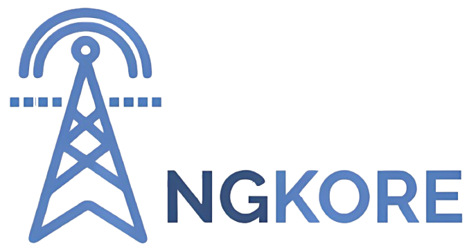

<!-- <picture>
 <source media="(prefers-color-scheme: dark)" srcset="../logo-without-bg.png">
 <source media="(prefers-color-scheme: light)" srcset="YOUR-LIGHTMODE-IMAGE">
 
</picture> -->

 

<!-- ##  -->

> NgKore is officially an Associate Member of ***Linux Foundation Networking(LFN)***

NgKore is an open-source community driving innovation across **Quantum Safe Network, Post-Quantum Cryptography (PQC), eBPF, 5G Advanced, 6G, O-RAN, NTN, AI/ML, Blockchain,** and **Quantum Simulations**. NgKore is more than just a project—it's a global, open ecosystem where collaboration fuels innovation. At the heart of NgKore is a commitment to *openness* and *interoperability*. 

*"NgKore is India's first open source community that works on Post Quantum Cryptography and eBPF"*

Our community actively engages with global open-source foundations and research alliances to shape the future of telecom and network infrastructure. In partnership with the University of Delhi (2023-2025), we have supported the institution in becoming a member or associate member of several leading open-source and standards organizations—including the **Magma Foundation, OpenAirInterface (OAI), LF Connectivity, Open Infrastructure Foundation (OIF), TARS Foundation, NextArch Foundation**,** and the **PKI Consortium**. 

In addition, we are actively associated with initiatives such as the **LFN Super Blueprint (SBP), Hyperledger, LF Decentralized Trust (LFDT), Post-Quantum Cryptography Alliance (PQCA), O-RAN Software Community (OSC), Nephio, L3AF, OpenSSL Foundation** and **OpenSSL Corporation**.

NgKore is sustained entirely through self-funded, bootstrapped efforts. Our progress is made possible through strong collaborations with academic institutions and industry partners, who support us with access to advanced testing infrastructure and resources.
You can support our work by sponsoring NgKore, your help sustain a vibrant open-source ecosystem committed to innovation, transparency, and global collaboration. Your support directly fuels development, community growth, and long-term impact—while aligning your brand with meaningful, forward-thinking initiatives.

Read more about NgKore on its official page [**here**](https://ngkore.org/pages/about).

